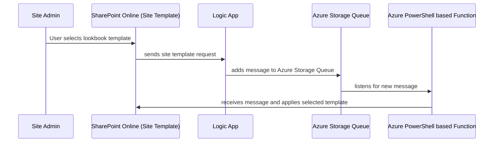

# spo-lookbook-template-applicator
 
## Solution Deployment
This solution is deployed using a Azure bicep template.   

## Solution Architecture

## Managed Identities and RBAC Roles

### Logic App
This solution enables a System Assigned Managed Identity on the Logic App.  This managed identity (service principal) is granted the "Storage Queue Data Message Sender" RBAC role on the Azure Storage Queue, allowing the Logic App's Service Principal to add messasges to the Azure Storage Queue.

### App Service
Additionally, the solution enables a System Assigned Managed Identity on the Azure Function's App Service (host).  This managed identity (service principal) is granted the "Storage Queue Data Message Processor" RBAC role on the Azure Storage Queue, allowing the Azur Function to automatically trigger when a new message is added to the Azure Storage Queue.  Finally, the App Service's Service Principal is granted "Sites.FullControl.All" rights to SharePoint Online (via grant-msi-permission.ps1).  This permssion set allows the App Service's Service Principal to authenticate to the target SharePoint Online site and apply the requested Lookbook template.

