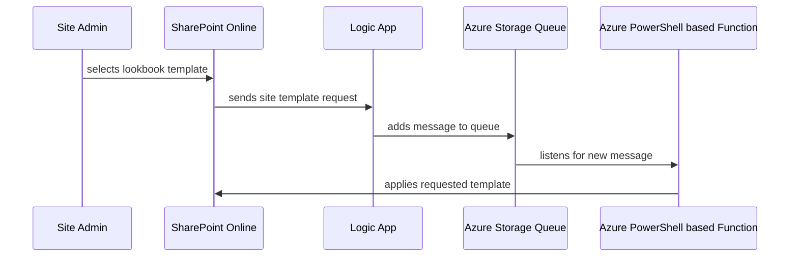

# Self-Hosted (Azure PaaS) Lookbook Template Applicator Solution

## Process Flow Diagram


## Summary
This solution is designed to allow companies to self-host (using Azure PaaS) their Lookbook Template Applicator process.  This particlar solution allows users to apply the <a href='https://lookbook.microsoft.com/details/c9300e94-6e83-471a-b767-b7878689e97e'>Landing</a> template or the <a href='https://lookbook.microsoft.com/details/6944f54d-cc8e-45ca-ba13-5f887a2d5f81'>Perspective</a> template to existing Communication Site in their Office 365 tenant.   

## Security Overview

### Logic App 
This solution enables a System Assigned Managed Identity on the Logic App.  This managed identity (service principal) is granted the "Storage Queue Data Message Sender" RBAC role on the Azure Storage Queue, allowing the Logic App's Service Principal to add messasges to the Azure Storage Queue.

### App Service
Additionally, the solution enables a System Assigned Managed Identity on the Azure Function's App Service (host).  This managed identity (service principal) is granted the "Storage Queue Data Message Processor" RBAC role on the Azure Storage Queue, allowing the Azure Function to automatically trigger when a new message is added to the Azure Storage Queue.  Finally, the App Service's Service Principal is granted "Sites.FullControl.All" rights to SharePoint Online (via grant-msi-permission.ps1).  This permssion set allows the App Service's Service Principal to authenticate to the target SharePoint Online site and apply the requested Lookbook template.

<br/>

## Deployment Prerequisites
- PnP.PowerShell module from the <a href='https://www.powershellgallery.com/packages/PnP.PowerShell'>PowerShell Gallery</a>
- Prequisites listed under: https://learn.microsoft.com/en-us/azure/azure-resource-manager/bicep/deploy-powershell#prerequisites

<br/>

## Azure Solution Deployment
This solution is deployed to to Azure using a <a href='https://learn.microsoft.com/en-us/azure/azure-resource-manager/bicep/deploy-powershell'>bicep template</a> and a PowerShell script. The *deploy-azure.ps1* script encapulates all the necessary deployment logic, the user only needs to provide the required parameter values.

```powershell
    # example usage
    .\deploy-azure.ps1 `
        -TenantId       '26c85e7b-4671-4eca-b109-85b44b405055' `
        -SubscriptionId '70aa515c-9dde-4894-8f31-440cd3e0404d' `
        -ResourceGroup  'rg-example-prod-eastus'
```
## App Service Managed Identity Permission
After the App Service has been successfully provisioned in Azure, retrieve the App Service's Managed Identity objectId from the Azure portal, under the Identity blade.  

In order for the App Service's System Assigned Managed Identity (Service Principal) to access sites in SharePoint Online, it needs to be granted *Sites.FullControl.All* rights to the Office 365 tenant. The PowerShell script *grant-msi-permission.ps1* will grant the necessary permission, however this script must be run as a Azure AD Administrator since it's granting a Application permssion to the service principal.  The FunctionMSIObjectId parameter is the objectId value retrived from the Azure portal.

### Example
```powershell
    # example usage
    .\grant-msi-permission.ps1 -FunctionMSIObjectId 'c029e5a6-9471-4b86-a6f7-8e1603017b2a'
```


## SharePoint Online Deployment
After the Azure Solution has been successfully deployed and App Service has been granted the necessary permission, the SharePoint solution can be deployed.  The two lookbook template options are deployed to SharePoint Online using the <a href='https://learn.microsoft.com/en-us/sharepoint/dev/declarative-customization/site-design-overview'>Site Template / Site Script</a> features of SharePoint Online.  The PowerShell scripts *deploy-spo.ps1* contains all the logic necessaary to deploy the templates and scripts to the tenant.  This script requires runs with an app-only context and requires Sites.FullControl.All application permission.    

### Example Usage
```powershell
    # example usage
    .\deploy-spo.ps1 `
        -PowerAutomateOrLogicAppTriggerUrl 'https://prod-45.eastus.logic.azure.com:443/workflows/......' `
        -Tenant 'contoso' `
        -ClientId '0e0ddd0a-3a5d-4cf4-9fb5-9fe266102b17' `
        -CertificateThumbprint 'fy4ryc57n28wbaubnf6bynqhputtqistt4zehxj9'
```


